# 2mAPI - CS2 Market Data Aggregator

A robust API facade that aggregates CS2 skin market data from multiple third-party marketplaces using a clean, maintainable architecture.

## Architecture Overview

### Facade Pattern Implementation

Our API implements the Facade design pattern to provide a simplified, unified interface for collecting CS2 skin market data from multiple sources. This pattern:

- Hides the complexity of interacting with multiple marketplace APIs
- Provides a consistent interface for data collection
- Reduces coupling between our application and individual marketplace APIs
- Simplifies maintenance and future marketplace additions

```mermaid
graph TD
    A[PriceAggregator Facade] --> B[ApiFactory]
    B --> C[HaloSkins API]
    B --> D[CSFloat API]
    B --> E[SkinPort API]
    B --> F[DMarket API]
    B --> G[Buff163 API]
    B --> H[Steam API]
    
    style A fill:#36454F,stroke:#333,stroke-width:2px
    style B fill:#36454F,stroke:#333,stroke-width:2px
```



### Core Components

1. **PriceAggregator (Facade)**
   - Provides unified methods for data collection
   - Manages API instances
   - Handles data export and formatting
   - Implements error handling and retries

2. **ApiFactory**
   - Creates API instances based on marketplace type
   - Manages API configurations and credentials
   - Ensures consistent API interface implementation

3. **Individual API Adapters**
   - Implement marketplace-specific logic
   - Handle rate limiting and quotas
   - Transform responses to a standard format

## Implementation Details

### Base API Class

The `SkinPriceAPI` class serves as the base interface for all marketplace APIs:

```javascript
export default class SkinPriceAPI {
  constructor(apiName, apiKey = null) {
    this.apiName = apiName;
    this.apiKey = apiKey;
    this.prefix = `[${apiName}]`;
  }

  async fetchPrices() {
    throw new Error("Each API class must implement the fetchPrices method");
  }

  formatData(data) {
    throw new Error("Each API class must implement the formatData method");
  }
}
```

### API Factory

The `ApiFactory` creates the appropriate API instance based on the marketplace name:

```javascript
export default class ApiFactory {
  static createApi(apiName, apiKey = null) {
    switch (apiName.toLowerCase()) {
      case 'csfloat':
        return new CSFloatAPI(apiKey);
      case 'skinport':
        return new SkinPortAPI(apiKey);
      case 'dmarket':
        return new DMarketAPI(apiKey);
      case 'buff163':
        return new Buff163API(apiKey);
      case 'haloskins':
        return new HaloSkinsAPI(apiKey);
      case 'steam':
        return new SteamAPI(apiKey);
      default:
        throw new Error(`Unknown API: ${apiName}`);
    }
  }
}
```

### Price Aggregator (Facade)

The `PriceAggregator` class implements the Facade pattern, providing a simplified interface for collecting and exporting price data:

```javascript
export default class PriceAggregator {
  constructor(marketHashNames) {
    this.apis = [];
    this.marketHashNames = marketHashNames;
  }

  addApi(api) {
    if (!(api instanceof SkinPriceAPI)) {
      throw new TypeError("API must be an instance of SkinPriceAPI");
    }
    this.apis.push(api);
  }

  async collectAllPrices() {
    const allPrices = [];

    for (const api of this.apis) {
      try {
        const rawData = await api.fetchPrices(this.marketHashNames);
        const formattedData = api.formatData(rawData);
        
        allPrices.push(...formattedData);

      } catch (error) {
        console.log(error);
        console.error(`Error collecting prices from ${api.apiName}: ${error.message}`);
      }
    }

    return allPrices;
  }

  async exportToJson() {
    // Implementation details for exporting data to JSON
    // ...
  }
}
```

### Marketplace API Implementation

Each marketplace API extends the base `SkinPriceAPI` class and implements the required methods:

```javascript
export default class CSFloatAPI extends SkinPriceAPI {
  constructor(apiKey = null) {
    super("CSFloat", apiKey);
  }

  async fetchPrices(marketHashNames) {
    // Implementation for fetching prices from CSFloat
    // ...
  }

  formatData(data) {
    // Implementation for formatting CSFloat data
    // ...
  }
}
```

## Data Schema

### Input Data

The system expects a list of market hash names in a text file:

```
AWP | Dragon Lore
AK-47 | Asiimov
M4A4 | Howl
```

### Output Data

The system produces a JSON file with the following structure:

```json
{
  "AWP | Dragon Lore": {
    "CSFloat": {
      "price": 1500.00,
      "float": 0.12,
      "rarity": "Covert",
      "paint_index": 344,
      "paint_seed": 12345,
      "quality": "Factory New",
      "stattrak": false,
      "souvenir": false
    },
    "SkinPort": {
      "price": 1450.00,
      "float": 0.15,
      "rarity": "Covert",
      "paint_index": 344,
      "paint_seed": 67890,
      "quality": "Factory New",
      "stattrak": false,
      "souvenir": false
    }
  },
  "AK-47 | Asiimov": {
    // Similar structure for other items
  }
}
```

## Rate Limiting and Error Handling

The system implements several strategies for handling API rate limits and errors:

1. **Rate Limit Detection**
   - Monitors API responses for rate limit indicators
   - Pauses execution when rate limits are hit
   - Resumes from the last processed item

2. **Error Recovery**
   - Catches and logs errors from individual APIs
   - Continues processing with other APIs when one fails
   - Provides detailed error messages for debugging

3. **Index Tracking**
   - Maintains an index file to track progress
   - Allows resuming from the last successful item
   - Prevents duplicate processing

## Setup and Usage

1. Install dependencies:
```bash
npm install
```

2. Configure environment variables:
```bash
# .env
CS_FLOAT_API_KEY=your_key_here
SKIN_PORT_API_KEY=your_key_here
```

3. Prepare market hash names:
```bash
# data/market_hash_names.txt
AWP | Dragon Lore
AK-47 | Asiimov
M4A4 | Howl
```

4. Run the aggregator:
```bash
node src/index.js
```

## Extending the System

### Adding a New Marketplace API

1. Create a new API class in `src/api/prices/`:

```javascript
import SkinPriceAPI from './skinprice.js';

export default class NewMarketplaceAPI extends SkinPriceAPI {
  constructor(apiKey = null) {
    super("NewMarketplace", apiKey);
  }

  async fetchPrices(marketHashNames) {
    // Implementation for fetching prices
    // ...
  }

  formatData(data) {
    // Implementation for formatting data
    // ...
  }
}
```

2. Update the `ApiFactory` to include the new API:

```javascript
import NewMarketplaceAPI from './api/prices/newmarketplace.js';

// In the createApi method:
case 'newmarketplace':
  return new NewMarketplaceAPI(apiKey);
```

3. Use the new API in the main application:

```javascript
const newMarketplaceApi = ApiFactory.createApi('newmarketplace', process.env.NEW_MARKETPLACE_API_KEY);
aggregator.addApi(newMarketplaceApi);
```

## Performance Considerations

1. **Sequential Processing**
   - Currently processes marketplaces sequentially
   - Could be improved with parallel processing using Promise.all

2. **Memory Usage**
   - Loads all market hash names into memory
   - Could be improved with streaming for large datasets

3. **File I/O**
   - Reads and writes to the filesystem for each item
   - Could be optimized with buffering and batch operations

## Future Improvements

1. **Parallel Processing**
   - Implement concurrent API calls
   - Add worker threads for CPU-intensive tasks

2. **Enhanced Error Handling**
   - Implement retry mechanisms with exponential backoff
   - Add circuit breakers for failing APIs

3. **Data Validation**
   - Add schema validation for API responses
   - Implement data consistency checks

4. **Caching**
   - Add Redis or in-memory caching
   - Implement cache invalidation strategies

5. **Monitoring**
   - Add Prometheus metrics
   - Implement health checks

## Contributing

1. Fork the repository
2. Create a feature branch
3. Implement changes
4. Add tests
5. Submit a pull request

## License

MIT License
